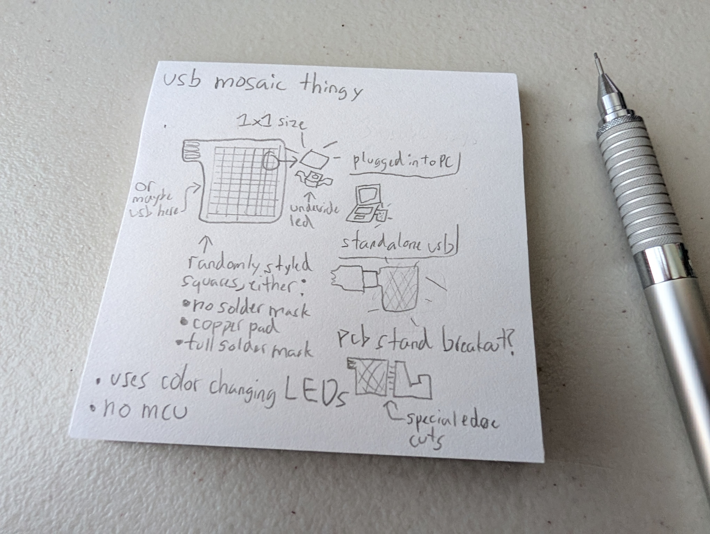
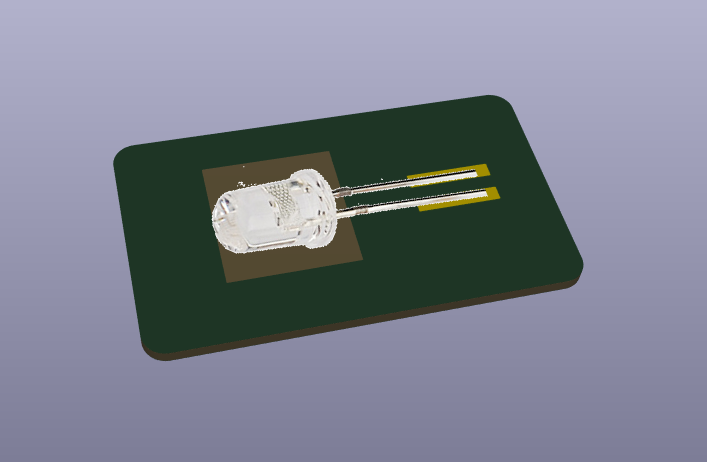
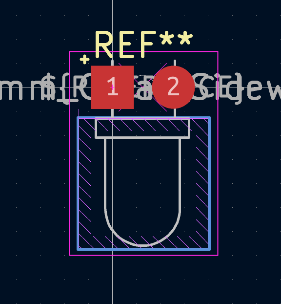

# Day 1: The Sketch

8/12/2026 - 15-30 minutes (post git repo creation)

I started sketching out my project and what idea i had in mind.

It was something that was
 * A simple usb 2.0 powered pcb
 * Light up glowing mosaic
 * Has no MCU
 * Strategic solder mask/copper placement
 * Maybe a cutout pcb stand footprint

# Day 2: Part Identification and Starting Schematic

8/13/2026 - ~1.5 hours

At first, I thought it was going to be easy to find these underside leds, but the terms for them are a little unstandardized and took a while to find.

They are "Reverse Gullwing" LEDs that can shine under itself, but some [hackaday](https://hackaday.io/page/6081-using-side-view-leds-in-place-of-reverse-mount-leds) articles (traced from another [article](https://hackaday.com/2019/04/17/the-science-of-reverse-mounted-leds/)) say that they're unfortunately expensive. 

I have been looking through a bunch of LED options, including but not limited to
 * Reverse Gullwing LEDs that need a mcu
 * Side mount LEDs (can't find one that cycles through colors)
 * Flat LEDs that can be soldered the opposite way

At this point, I will take a compromise of these [tht LEDs](https://www.sparkfun.com/led-3mm-cycling-rgb-fast.html) that cycle colors and are really small. The previous hackaday article recommended hot glue on side mount leds to help spread into the pcb, but why not just use tht leds with hot glue anyways?

# Day 3: Actual Schematic Work + Calculations

8/14/2026 - 1hr 

I plan to make the pcb small ish, like the dimensions of a standard sticky/post note (71x71mm)

Each LED would take a 5.5mm square, excluding the legs which would make it 5.5x~8mm total for each cube that is lit up on my mosaic.

The mosaic itself would not actually be fully filled with LEDs, but have some randomness in different sections to help fit some extra components. 

PCB surface area: 5041 = 71^2

LED footprint: 44 = 5.5*8

Not allocating the entire board for leds: 5041/5 = 1008.2 surface area left

1008/44 = ~22 LEDs that I can fit into spots in my mosaic